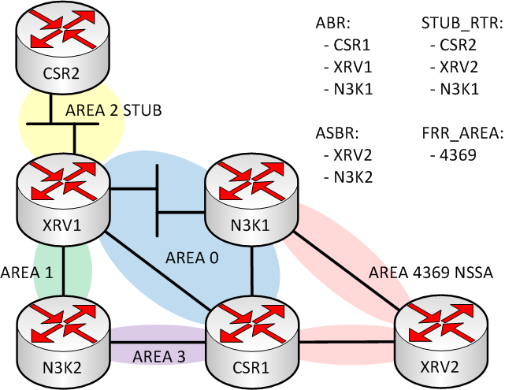

# Continuous Integration (CI) pipeline
This project is automatically tested using [Travis CI](https://travis-ci.org)
using the file `.travis.yml` in the previous directory. CI testing spans
three distinct stages in this project:

  1. [Quick start](#quick-start)
  2. [Linting code](#linting-code)
  3. [Unit tests](#unit-tests)
  4. [Integration tests](#integration-tests)

## Quick start
From the main `nots` directory, use the `make test` target and it will
kick off all three of the test phases in the proper sequence.

## Linting code
All source code is linted before any code is actively executed. Using
the `make lint` target from the main `nots` directory checks all YAML and Python
files for syntax and styling issues. Additionally, static code
analysis is applied to Python code to identify any security issues before
execution.

## Unit tests
All custom Python filters (which are individual, independent functions) are
tested next. The `tests/tasks` directory contains an Ansible task list for
each function. These are the parsers used to transform CLI output (text)
from the network devices into structured data. Each test displays the
structured data to stdout as JSON for troubleshooting and human validation.

The playbook called `tests/unittest_playbook.yml` automatically includes
these task lists for execution. The tests are kept simple using static text
input with bogus values to ensure the parsers function correctly. Use
the `make unit` target from the main `nots` directory to run unit tests.

## Integration tests
Test the entire playbook for all supported platforms using mock data
to simulate virtual devices. This is a faster and lower cost way to test
the playbook compared to spinning up virtual devices. The test topology
below is used.

### Mock device output
The `tests/vars/` directory contains an Ansible variables file in the
format `mock_{{ inventory_hostname }}.yml` which represents a specific
host within the test topology. This fabricated data matches what is defined
in the `hosts.yml` and `group_vars/` files so that the tests pass. In
summary, the host/group variables identify what "right looks like", the mock
data has been written to be "right", and the diagram shows the full topology.
All three pieces of information are telling the sames tory.

### Running tests
The easiest way to manually run this test is to use the `make integ` command
from the main `nots` directory. Behind the scenes, this executes the
`integration_playbook.yml` playbook and overrides two variables:
  * `ci_test` is set to `true`, which skips logging into any network devices
  * `log` is set to `false`, since there isn't any meaningful network data
